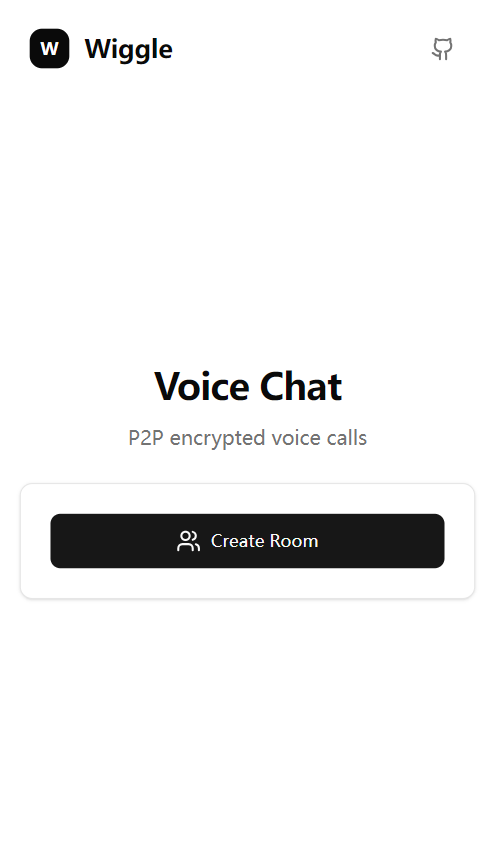
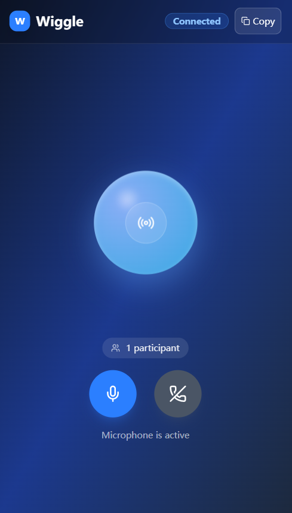

# Wiggle - Decentralized Voice Chat Application

[](https://vercel.com/new/clone?repository-url=https://github.com/Yooi/Wiggle)
[](https://app.netlify.com/start/deploy?repository=https://github.com/Yooi/Wiggle)
[](https://zeabur.com/templates/LWSTGM?referralCode=Yooi)
[](https://gitpod.io/#https://github.com/Yooi/Wiggle)

## 🚀 Quick Deploy

Choose your preferred platform for one-click deployment:

- **Vercel**: Click the button above for automatic deployment to Vercel
- **Netlify**: Simple and user-friendly with global CDN acceleration
- **Zeabur**: China-friendly access with fast deployment
- **GitHub Pages**: Automatic CI/CD with free hosting

📖 **Detailed Deployment Guide**: [DEPLOY.md](./DEPLOY.md)

## 📸 Preview

<div align="center">
  
  
</div>

## Overview

Wiggle is a modern decentralized voice chat application built with React + TypeScript, featuring a beautiful ChatGPT-style interface with an innovative liquid voice orb visualization. The goal is to enable peer-to-peer voice communication without relying on centralized servers.

## ✨ Current Status

✅ **Completed Features**:
- Modern React + TypeScript + Vite architecture
- Beautiful ChatGPT-style responsive UI design
- Innovative VoiceOrb component with liquid visualization effects
- Complete room creation and joining functionality
- **Real WebRTC P2P Voice Chat** with signaling server
- **Multi-user Voice Rooms** with real-time participant management
- Real-time audio processing with AudioManager
- WebSocket signaling server for connection coordination
- Responsive design optimized for desktop and mobile
- Navigation system with React Router
- Performance-optimized animations

🚧 **In Development**:
- STUN/TURN servers for NAT traversal
- Advanced audio quality controls
- End-to-end encryption
- Mobile app integration

## 🎨 Key Features

### Modern UI Design
- **ChatGPT-style Interface**: Full-screen immersive chat experience
- **Liquid Voice Orb**: Beautiful animated visualization that responds to voice
- **Responsive Design**: Optimized for all screen sizes
- **Dark Theme**: Elegant gradient backgrounds and glassmorphism effects
- **Smooth Animations**: Performance-optimized transitions and effects

### Audio & Voice
- **Real Microphone Access**: Integrated with Web Audio API
- **Voice Level Visualization**: Real-time audio level detection
- **Mute/Unmute Controls**: Easy voice control with visual feedback
- **Audio Quality**: High-quality WebRTC audio transmission

### P2P Network
- **Decentralized Architecture**: No central server required
- **WebRTC Integration**: Direct peer-to-peer audio streaming
- **Circuit Relay v2**: Enhanced connectivity and NAT traversal
- **Gossipsub Messaging**: Efficient message distribution

## 🛠️ Tech Stack

### Frontend Framework
- **React 19.1.1** - Modern React with latest features
- **TypeScript** - Type-safe development
- **Vite** - Fast build tool and dev server
- **React Router** - SPA navigation

### UI & Styling
- **Tailwind CSS** - Utility-first CSS framework
- **shadcn/ui** - High-quality React components
- **Lucide React** - Beautiful icon library
- **Responsive Design** - Mobile-first approach

### P2P & Audio
- **libp2p 2.10.0** - Modular P2P networking stack
- **@libp2p/webrtc** - WebRTC transport layer
- **@libp2p/circuit-relay-v2** - Enhanced connectivity
- **@chainsafe/libp2p-gossipsub** - Pub/sub messaging
- **Web Audio API** - Real-time audio processing

### State Management
- **Zustand** - Lightweight state management
- **React Hooks** - Modern state handling

## 📁 Project Structure

```
src/
├── components/              # Reusable UI components
│   ├── ui/                 # shadcn/ui base components
│   └── VoiceOrb.tsx       # Animated voice visualization
├── lib/                    # Core libraries
│   ├── audio/             # Audio management
│   │   └── AudioManager.ts
│   ├── p2p/               # P2P networking
│   └── utils.ts           # Utility functions
├── pages/                  # Application pages
│   ├── Landing.tsx        # Homepage with room creation
│   └── Room.tsx           # Voice chat room interface
├── hooks/                  # Custom React hooks
├── App.tsx                # Main application component
└── main.tsx               # Application entry point
```

## 🎯 User Experience

### Landing Page
- **Minimal Design**: Clean interface with logo and room creation
- **Room Generation**: Create unique room IDs instantly
- **Quick Join**: Enter existing room IDs to join

### Voice Room
- **Full-Screen Interface**: Immersive ChatGPT-style layout
- **Central Voice Orb**: Beautiful liquid animation responding to voice
- **Responsive Controls**: Easy-to-use mute, copy, and leave buttons
- **Participant Management**: Real-time participant status display
- **Navigation**: Click logo to return to homepage

### VoiceOrb Component
- **Liquid Animation**: Smooth, organic-looking voice visualization
- **Performance Optimized**: Efficient rendering with minimal CPU usage
- **Responsive Design**: Adapts to different screen sizes
- **Real-time Response**: Immediate reaction to audio input

## 🚀 Development

### Prerequisites
- Node.js 18+ 
- npm or pnpm

### Local Development

#### 1. Clone and Install
```bash
# Clone the repository
git clone https://github.com/Yooi/Wiggle.git

# Install dependencies
npm install
```

#### 2. Start Signaling Server
```bash
# In terminal 1: Start signaling server
cd signaling-server
npm install
npm start
# Server runs on ws://localhost:3002
```

#### 3. Start Frontend
```bash
# In terminal 2: Start development server
npm run dev
# Frontend runs on http://localhost:3001
```

#### 4. Test Voice Chat
1. Open `http://localhost:3001` in two different browser tabs
2. Create a room in the first tab
3. Copy the room URL and open in the second tab
4. Click "Join Voice Chat" in both tabs
5. Allow microphone access when prompted
6. Start talking to test P2P voice connection!

### Available Scripts
```bash
npm run dev          # Start development server
npm run build        # Build for production
npm run build:github # Build for GitHub Pages
npm run preview      # Preview production build
npm run lint         # Run ESLint
```

### Deployment Scripts
```bash
# Windows
scripts\deploy.bat vercel
scripts\deploy.bat github

# Linux/Mac
./scripts/deploy.sh vercel
./scripts/deploy.sh github
```

## 🏗️ Deployment Options

### 1. One-Click Deployment (Recommended)
- **Vercel**: Fast, automatic CI/CD with global CDN
- **Netlify**: Simple drag-and-drop deployment
- **Zeabur**: China-friendly with fast deployment
- **Railway**: Container-based deployment

### 2. Automatic CI/CD
- **GitHub Pages**: Automatic deployment on push
- **GitHub Actions**: Configured for seamless deployment

### 3. Online Development
- **Gitpod**: Cloud-based VS Code environment
- **CodeSandbox**: Instant online editing
- **StackBlitz**: Fast online development

## 🔧 Configuration Files

The project includes comprehensive deployment configurations:

- `.github/workflows/deploy-github-pages.yml` - GitHub Actions workflow
- `vercel.json` - Vercel deployment configuration
- `netlify.toml` - Netlify deployment settings
- `zbpack.json` - Zeabur deployment configuration
- `.gitpod.yml` - Gitpod development environment
- `railway.toml` - Railway deployment settings

## 🛡️ Security & Privacy

### P2P Security
- **Encrypted Connections**: All WebRTC connections are encrypted
- **No Central Server**: Direct peer-to-peer communication
- **Temporary Room IDs**: Rooms expire after inactivity

### Privacy Protection
- **No Data Storage**: No user data stored on servers
- **Local Processing**: All audio processing happens locally
- **Anonymous Usage**: No user tracking or analytics

## 🗺️ Roadmap

### Phase 1: Core Foundation ✅
- ✅ Project architecture and setup
- ✅ Modern UI implementation
- ✅ VoiceOrb component development
- ✅ Basic P2P networking
- ✅ Audio integration

### Phase 2: Enhanced Features 🚧
- 🔄 Improved P2P reliability
- 🔄 Advanced audio controls
- 🔄 Connection quality indicators
- 🔄 Enhanced error handling

### Phase 3: Advanced Capabilities 📋
- 📋 End-to-end encryption
- 📋 Group voice channels
- 📋 Screen sharing capability
- 📋 Advanced audio processing

### Phase 4: Polish & Optimization 📋
- 📋 Performance optimizations
- 📋 Accessibility improvements
- 📋 Comprehensive testing
- 📋 Documentation completion

## 🤝 Contributing

We welcome contributions! Please see our contributing guidelines:

1. Fork the repository
2. Create a feature branch: `git checkout -b feature/amazing-feature`
3. Commit your changes: `git commit -m 'Add amazing feature'`
4. Push to the branch: `git push origin feature/amazing-feature`
5. Open a Pull Request

### Development Guidelines
- Follow TypeScript best practices
- Maintain responsive design principles
- Ensure cross-browser compatibility
- Write clean, documented code
- Test on multiple devices

## 📄 License

This project is licensed under the MIT License - see the [LICENSE](LICENSE) file for details.

## 🔗 Links

- **Live Demo**: [Deploy now and get your own link!]
- **Documentation**: [DEPLOY.md](./DEPLOY.md)
- **Issues**: [GitHub Issues](https://github.com/Yooi/Wiggle/issues)
- **Discussions**: [GitHub Discussions](https://github.com/Yooi/Wiggle/discussions)

## ⭐ Show Your Support

If you like this project, please consider giving it a star on GitHub! It helps us understand that our work is valuable and motivates us to continue improving Wiggle.

---

**Built with ❤️ using modern web technologies**
